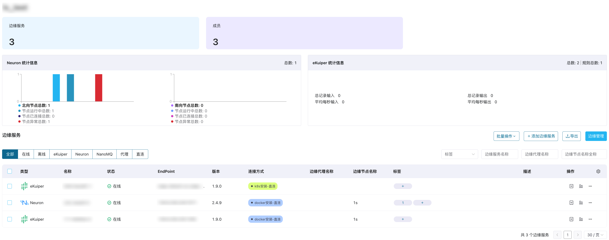

# 边缘服务管理

## 边缘服务
边缘计算是指在离用户最近的边缘设备上进行计算和数据处理，这样可以提高网络系统的响应速度，缩短数据传输的距离和时间，提高数据安全性，保护数据隐私。

边缘服务管理是 ECP 平台核心功能之一，是针对边缘计算软件进行管理的一种服务模式。ECP 边缘服务管理，主要指对边缘软件 Neuron、eKuiper、NanoMQ 的服务部署、管理、配置下发、批量操作、监控和优化。

## 访问边缘服务页面

用户登陆后，点击工具栏的**工作台**按钮进入**工作台**界面，点击左侧导航栏的**边缘服务**即可进入**边缘服务**页。

:::tip

系统管理员、组织管理员、项目管理员和该项目的普通用户均可访问此页面。

有关不同用户角色的权限说明，见[角色权限一览表](../acl/authorize.md#角色权限一览表)
::: 

对于基于 Kubernetes 和基于 Docker 部署的 ECP，在边缘服务管理上存在一定的功能差异，具体请参考 [Kubernetes 与 Docker 部署的功能差异](../install/introduction.md#kubernetes-与-docker-部署的功能差异)。

本章将主要介绍以下主题：

- [批量安装边缘服务](batch_intall)
- [导入现有边缘服务](batch_import)
- [项目级监控统计](edge_project_statistics)
- [边缘服务认证](e2c)
- [标签及分组](batch_tag)
- [升级边缘服务](batch_upgrade)
- [边缘配置批量下发](batch_distribution)
- [边缘服务管理运维](edge_ops)
