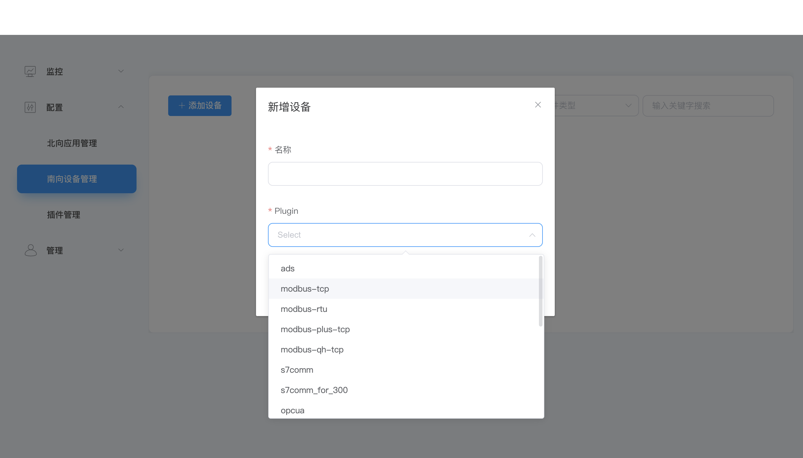
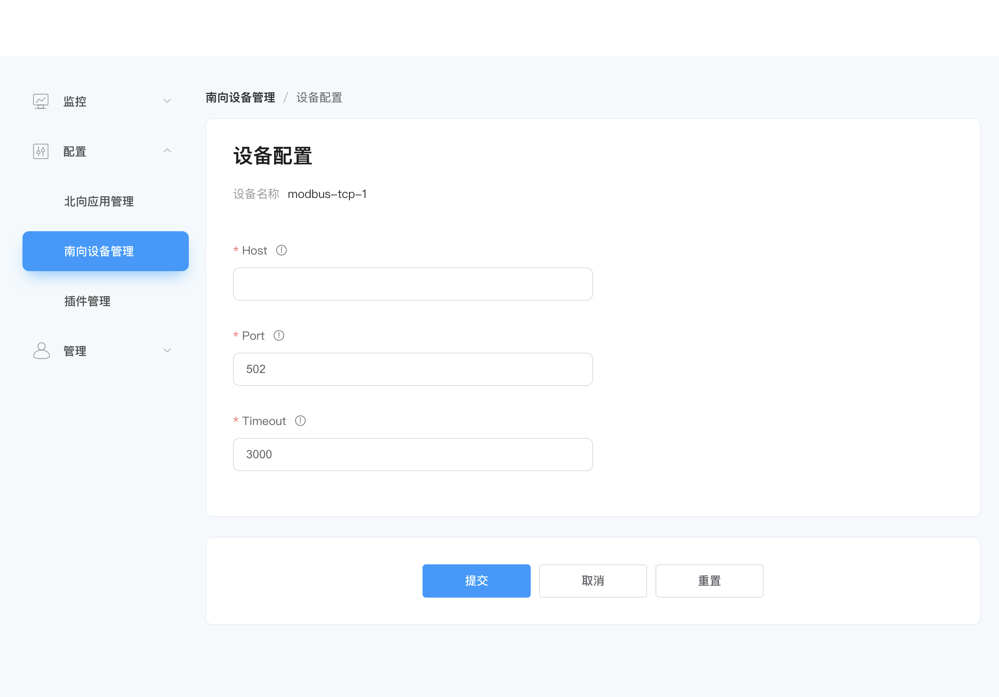

# 连接 PeakHMI Slave 模拟器

本节主要介绍 NeuronEX 作为 Client，PeakHMI Slave Simulator 作为 Server 时，NeuronEX 与 Modbus Slave 的相关配置。

NeuronEX 作为 Client，主动向 Modbus Slave 发起连接请求，用户需要保证 NeuronEX -> Modbus Slave 的网络连通性。

## 安装 Modbus Slave 模拟器

安装 PeakHMI Slave Simulators 软件，安装包可在 [PeakHMI 官网](https://hmisys.com) 中下载。

安装后，运行 Modbus TCP slave EX。设置模拟器点位数值及站点号，如下图所示。

:::tip 须保证 NeuronEX 与模拟器运行在同一局域网内。

Windows 中尽量关闭防火墙，否则可能会导致 NeuronEX 连接不上模拟器。 

:::

## 登录 NeuronEX

打开 Web 浏览器，输入运行 NeuronEX 的网关地址和端口号，即可进入到管理控制台页面，默认端口号为 7000。访问格式，http://x.x.x.x:7000。x.x.x.x 代表安装 NeuronEX 的网关地址。

页面打开后，进入到登录界面，用户可使用初始用户名与密码登录（初始用户名：admin，初始密码：0000）。

## 添加南向设备

创建南向设备卡片可用于 NeuronEX 与设备建立连接、设备驱动协议的选择及设备数据采集点位的配置。

在 `配置` 菜单中选择 `南向设备管理`，进入到南向设备管理界面，单击 `添加设备` 按键新增设备，如下图所示。

添加一个新的南向设备：

- 名称：填写设备名称，例如 modbus-tcp-1；
- Plugin：下拉框选择 modbus-tcp 的插件；
- 点击 `创建` 按键新增设备。

### 设置南向设备参数

配置 NeuronEX 与设备建立连接所需的参数。

单击南向设备卡片上的 `设备配置` 按键进入设备配置界面，如下图所示。

- Host：填写安装 PeakHMI Slave Simulators 软件的 PC 端 IP 地址。
- 点击 `提交`，完成设备配置，设备卡片自动进入 **运行中** 的工作状态。