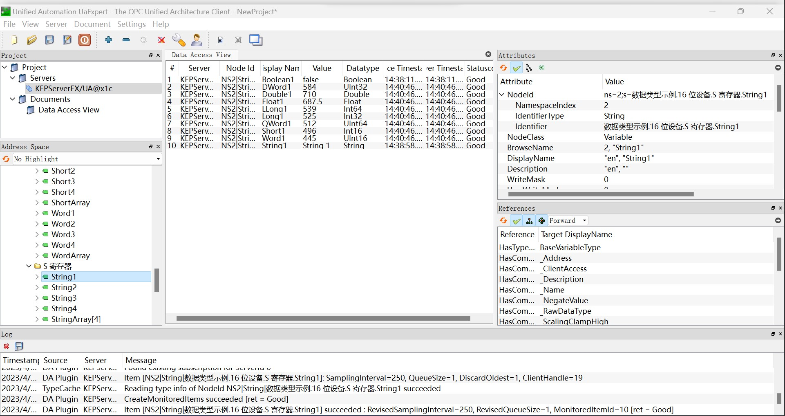

# 连接 KEPServerEX

## 用户名/密码登录

1. 右键点击系统托盘中的 KEPServerEX 图标，在菜单中选择 **设置** -> **KEPServerEX 设置** -> **用户管理器**，在 `Administrators` 组下新建用户，设置用户名/密码;

2. 双击系统托盘中的 KEPServerEX 图标，在主界面中打开 **项目** -> **属性编辑器** -> **OPC UA**， `允许匿名登录` 设置为 `否`;

3. 右键点击系统托盘中的 KEPServerEX 图标，在菜单中选择 **OPC UA 配置** -> **服务器端点**，双击端点条目，勾选所有安全策略。

4. 右键点击系统托盘中的 KEPServerEX 图标，在菜单中选择 **重新初始化**；

5. NeuronEX 新增南向 OPC UA 设备，打开 **设备配置**，填写目标 Server 的 `端点 URL`，填写用户名/密码，无需添加证书/密钥，启动设备连接；

6. 右键点击系统托盘中的 KEPServerEX 图标，在菜单中选择 **OPC UA 配置** -> **受信任的客户端**，将 NeuronEXClient 证书设置为信任。

7. 右键点击系统托盘中的 KEPServerEX 图标，在菜单中选择 **重新初始化**；

## 证书/密钥 + 用户名/密码登录

1. 按照上文设置用户名/密码；

2. 参考[连接策略](./policy.md)生成或转换证书/密钥；

3. 右键点击系统托盘中的 KEPServerEX 图标，在菜单中选择 **OPC UA 配置** -> **受信任的客户端**，将 DER 格式的客户端证书导入列表；

4. 右键点击系统托盘中的 KEPServerEX 图标，在菜单中选择 **重新初始化**；

## NeuronEX 侧配置

1. 通过 UaExpert 软件查看 KepServerEx 测点信息， 参考 [配置 UaExpert](./uaexpert.md)。

2. NeuronEX 新增南向 OPC UA 设备，打开 **设备配置**，填写目标 Server 的 `端点 URL`，填写用户名/密码，添加证书/密钥，启动设备连接；

3. 根据测点信息添加 `Groups` 和 `Tags`。

## 测试点位

| 名称     | 地址                                       | 属性       | 类型   |
| -------- | ------------------------------------------ | ---------- | ------ |
| Boolean1 | 2!数据类型示例.16 位设备.R 寄存器.Boolean1 | Read Write | BOOL   |
| DWord1   | 2!数据类型示例.16 位设备.R 寄存器.DWord1   | Read Write | UINT32 |
| Double1  | 2!数据类型示例.16 位设备.R 寄存器.Double1  | Read Write | DOUBLE |
| Float1   | 2!数据类型示例.16 位设备.R 寄存器.Float1   | Read Write | FLOAT  |
| LLong1   | 2!数据类型示例.16 位设备.R 寄存器.LLong1   | Read Write | INT64  |
| Long1    | 2!数据类型示例.16 位设备.R 寄存器.Long1    | Read Write | INT32  |
| QWord1   | 2!数据类型示例.16 位设备.R 寄存器.QWord1   | Read Write | UINT64 |
| Short1   | 2!数据类型示例.16 位设备.R 寄存器.Short1   | Read Write | INT16  |
| Word1    | 2!数据类型示例.16 位设备.R 寄存器.Word1    | Read Write | UINT16 |
| String1  | 2!数据类型示例.16 位设备.S 寄存器.String1  | Read Write | STRING |

